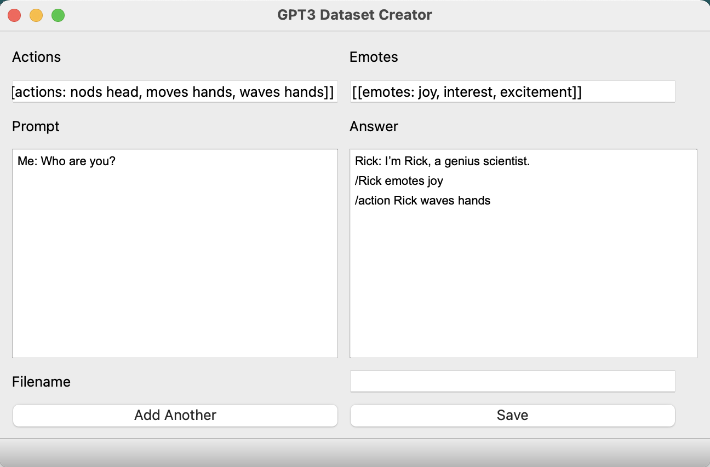

# GPT3-dataset-creator
Small GUI application for easy creation of OpenAI GPT3 datasets

Can be used to create `.json` datasets which can be directly used by the finetuning cli tool from OpenAI to create `prompts` and `completions`.

Usage:

1. Clone the Github Repo and install dependencies:
    ```
    git clone https://github.com/SnoozingSimian/GPT3-dataset-creator.git
    cd GPT3-dataset-creator
    pip install -r requirements.txt
    ```

2. Launch the app.
    ```
    python main.py <data_dir>
    ```
The rest of the app is pretty self explanatory.

Note: Always use the `Add Another` button and ensure that both the `Prompt` and `Answer` fields are clean before clicking `Save`.

Here is how it looks like, pretty barebones I know, but it gets the job done!



Let us assume you saved the file as `datafile.json`. You can then use the OpenAI CLI tool to format it to the accepted `JSONL` format.
    ```
    openai tools fine_tunes.prepare_data -f <data_dir>/datafile.json
    ```